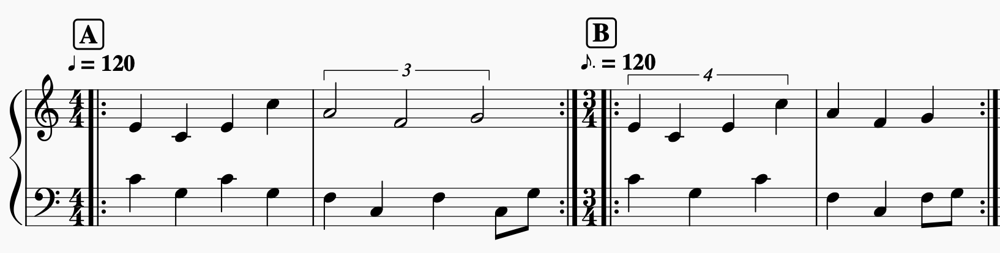

## Advanced Techniques

Let's look at some more advanced topics to handle time:

### Creating arpeggios using length

Like mentioned earlier, the difference between length and duration is: length has no effect on the total duration of the group. This enables us to create arpeggios:

<button id="example-length">Show Example</button>
<button id="example-lengthShort">Short Notation</button>

In the Example, the note lenghts exceed their group. This would not be possible in western staff notation without using ties.

<!-- In the future, there will be shorthand symbols for string notation for common articulations. -->

### Syncopation

With, length we can also create syncopated notes. Syncopation is when a notes' duration exceeds the group. It is heavily used in all kinds of popular music genres:

<button id="example-syncopation">Show Example</button>

There will also be a tie flag in the future with which notes can be prolonged (like in western notation).

### TBD: Ties

### TBD: Swing

### Polyrhythms vs Metric Modulation

So far we did not talk about time signatures. Before we talk about changing time signatures, lets have a look at Polyrhythms.  
Here are two examples, where the melody stays exactly the same, but the bass melody plays different pulses/time signatures:

<button id="example-triplets">A: 4/4 quarters + half note triplets</button>
<button id="example-quartuplets">B: 3/4 quarter quartuplets + quarters</button>

<button id="example-tripletsShort">A short</button>
<button id="example-quartupletsShort">B short</button>

Depending on the bass, one of the two melody bars will go against the pulse. This is because two different sized grids are playing at the same time. This is also called a polyrhythm:

- Example A is called "3 against 4"
- Example B is called "4 against 3"
- "x against y": x is the "foreign" grid size and y is the established pulse

In music theory, this can be expressed using tuplets:

The same thing could also be notated using metric modulations:

The crucial part here is the tempo change:

- The first bar has 120 quarter notes (=4 8th notes) per minute
- The second bar has 120 pointed 8ths notes (=3 8th notes) per minute.
- This reflects the opposition of 4 and 3

Depending on the context of the piece, both notations can be found in the real world:

- Tuplets are used for only short passages, that go against the normal pulse.
- Metric modulation is used when the time signature should change permanently. The part where both grids are superimposed is normally used as a pivot point for a smoother/easier transition.

When you compare the two bass parts of A and B, you'll notice that the part of B is slower. This is because B fits 3 and A fits 4 pulses in the same duration.

- Check [this video about metric modulations used by the Beatles](https://www.youtube.com/watch?v=AzsKR7vNzAA)
- Check [this recording of the Miles Davis Quintet](https://www.youtube.com/watch?v=XK7uH_pKIAI) for a masterful example of 3 vs 4 metric modulation.

### Changing Time Signatures vs Odd Meter

If we want to keep the same tempo/pulse while having less notes (=time signature change), we either have to adjust each measures duration (C) or pack both measures into one (C'):

<button id="example-timeChange">C: 4/4 + 3/4</button>
<button id="example-sevenfour">C': 7/4</button>

As notation, C would be a "normal" time signature change while C' just adds the two measures to a so called "odd meter":

Like with tuplets vs modulations, both of these notations can be found in the real world:

- Changing time signatures for a one time, permanent change in bar length
- Using odd time signatures to keep changing between group lengths

#### Change time signature for multiple measures

Now if we want a permanent time signature change, we have to specify the duration for every single measure. That's not very sleek..

We could avoid that by wrapping all measures with the same time signature into one block and set the duration to n\*t:

- n is the number of measures
- t is the amount of beats per measure

<button id="example-timeChangeB">Show Example</button>

**The Problem:** Each time you add a measure to a block, all the ratios are changing and you have to recalculate.

**Solution:** duration has an array notation! This will autocalculate the block duration by multiplying the number of items with the specified duration:

<button id="example-timeChangeC">Show Example</button>

**TLDR;** To set a time signature for multiple measures, wrap them in block with _duration: [beats]_. This way you can add and remove measures without having to change anything else.

#### TBD: Duration on Groups

=> [C D E F]*4 [C D E]*3

### TBD: Groupings / assign properties to children

=> { "m": "[C D E F][c d e]", "duration": [4,3] }

### TBD: Polymeter

<!-- ### Comparison: rhythmical vs western staff notation

As we saw in the bolero example, there are big similarities between western staff notation and rhythmical. Being not restricted to a 2d sheet of paper, rhythmical notation can do a lot more and therefore could be called a superset of western notation.

When can rhythmical notation be converted to a staff notation? Or differently put: What should be avoided to be compliant with western notation?

*   No group overflow => note end should not exceed group end
*   Use ties for syncopation to avoid overflow
*   Duration maps to greater note value while tie maps to tie...
*   Polyphony should remain as homophonic as possible
*   Non homophonic polyphony should be seperated to multiple staffs -->

### TBD: seconds

Idea: specifying the seconds of any block is engough to determine the total length.

### TBD: Loops & Pickups

## TBD: Plugins

### TBD: Format Subsets

### TBD: Parameter Automation

### Harmonic Plugins

#### TBD: Transposition

#### TBD: Degrees

#### TBD: Chords

## TBD: Live Coding with Tone.js

### TBD: Seamless Cycles
