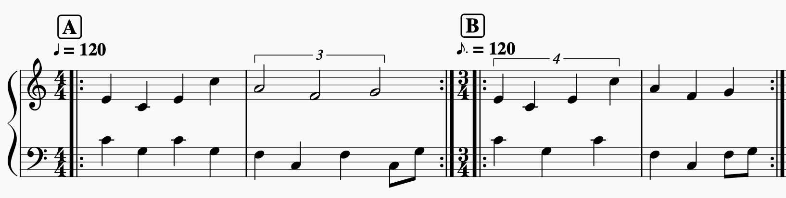
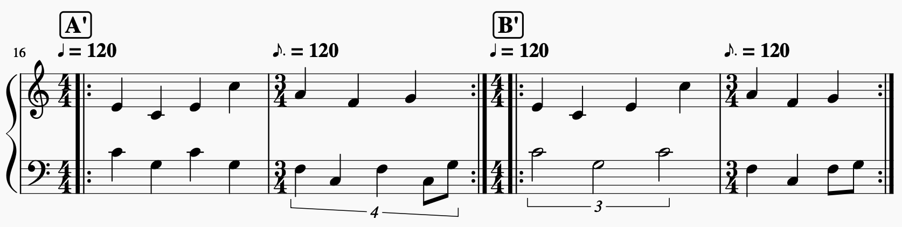
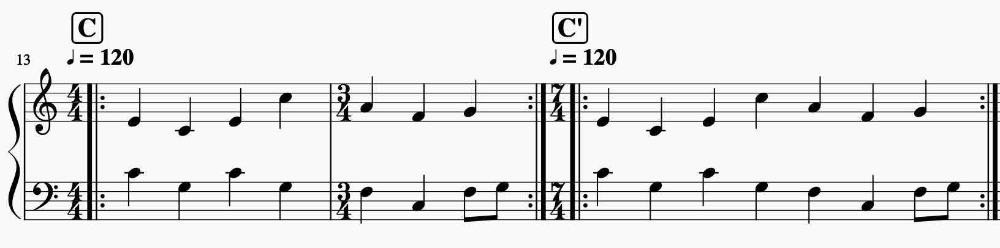

# rhythmical REPL

This the [REPL](https://en.wikipedia.org/wiki/Read%E2%80%93eval%E2%80%93print_loop) and Tutorial for [rhythmical](https://github.com/felixroos/rhythmical/), a text & JSON based music language for Javascript.

The top left box is the input and the bottom left is the rendered output (hover to see json), which is used by [Tone.js](https://tonejs.github.io/) for playback.

<!-- ## Patterns

<pre>
{
  "pattern": ["", 1, 1, "", 1, 1, "", 1, 1, "", 1, 1],
  "fill": [
    ["F3/A3/C3"],
    ["F3/A3/C3"],
    ["F3/A3/C3"],
    ["F3/A3/C3"],
    ["F3/Bb3/D3"],
    ["F3/Bb3/D3"],
    ["F3/Bb3/Db3"],
    ["F3/Bb3/Db3"]
  ]
}
</pre> -->

## Why rhythmical?

- Name and approach inspired by [tonal](https://github.com/tonaljs/tonal)
- Pun: rhythmi**cal**culation
- The insight that musical rhythm is nothing but number ratios / fractions
- There is nothing like it yet (at least in JS)

## Why should I care? Amaze me!

Ok, here are some Demos:

<button id="example-swimming">Super Mario World - Swimming Theme</button>  
<button id="example-cantaloupe">Herbie Hancock- Cantaloupe Island</button>  
<button id="example-starworld">Super Mario World - Star World Theme</button>
<button id="example-zeldasRescue">A Link To The Past - Princess Zeldas Rescue</button>
<button id="example-slengTeng">Sleng Teng Riddim</button>
<button id="example-realRock">Real Rock Riddim</button>

If you are not amazed, maybe you should not be doing music with Javascript and try a DAW or Notation software instead.

If you are at least mildly amazed, read on...

## Meta Design Goals

- Be **inclusive**: Musician / Human friendly
- Be **gentle**: Let the computer do the calculation
- Be **easy to learn**: The less API, the better.
- Be **relative**: let the only absolute number be the target length/tempo
- Be **semantic**: Everything is groupable
- Be **isomorphic**: Format should be morphable but keep all infos
- Be **non-redundant**: Use same concepts for all levels of time
- Be **quick**: Minimum keystrokes required
- Be **non-biased** by culture: rhythm is universal while pitch systems are not
- Be **extendable**: Provide hooks for functionality extension
- Be **standardized**: Provide methods for validation
- Be **open**: Allow modification

## TLDR; Show me API

_NOTE: This is a quick API overview, a Step by Step Tutorial can be found below_

A rhythmical "**Block**" can be one of three types:

- A **primitive** (neither Array nor Object)
- An **Array** of "Block"s
- A Block **Object** with the following basic properties:
  - **p**: polyphonic Block(s)
  - **m**: monophonic Block(s)
  - **time**: when does it start
    - p default: 0
    - m default: sum of all previous Blocks durations
  - **duration**: how long is it, relative to Block
    - p default: 1
    - m default: 1/sum of all Blocks durations

This is the basic API. This alone allows to encode any rhythmical information (and more).

# Tutorial

Lets learn the basics by looking at and hearing some Examples.

## About the Editor

- The top left area is the input format (human)
- The bottom left area contains the rendered output (machine)
- The output is regenerated on every keystroke
- You can play and stop via the buttons
- When pressing play while something is already playing, it will wait till the end before playing the new input.
- In the Tutorial there are many Examples that can be loaded into the Editor. They will be played immediately
- Currently, you cannot save files, so save them for yourself somewhere...

## Monophony Basics

Lets start the tutorial by learning the basics of monophonic melodies.

### One Note: Concert Pitch

This Example just plays a single note for one second. It contains nothing than the primitive string 'A4'.

<button id="example-a">Show Example</button>

Let's look at the output (bottom left). It will always contain an object of the following structure:

- seconds: The absolute length in seconds
- p: contains all events in absolute form
- m: the note / or any content you put in
- path: see below
- time: the start time of the note attack
- duration: the duration of the note

### Two Notes: German Ambulance

This Example plays two notes like a german ambulance. It contains an Array of two primitives. This will play the notes in sequence.

<button id="example-fourth">Show Example</button>

The same can be achieved by seperating the notes with a space:

<button id="example-fourthShort">Show Example</button>

This will be converted to an Array under the hood.

### About the path

The path is an Array containing Arrays of three numbers: [time, block duration, event duration]:

- time: time of the event, relative to its Block
- block duration: the sum of all the blocks event durations
- duration: the duration of the event, relative to its Block
- In our Example, the first note starts at time 0, with a block duration of two and a duration of 1
- The second note starts at time 1, with the same block duration/duration.

**Why?** The path is used to calculate the absolute time & duration of an event. It is a good way to keep track of an elements position while keeping everything smoothly integer & precise. In the end, only one calculation is made to determine the absolute numbers. The path also contains the grouping information => no information loss.

### More Notes: Major Scale

Lets play a major scale

<button id="example-major1">Show Example</button>
<button id="example-major1short">Show Short Example</button>

That's really quick.. This is because the default time is 1 second. We can slow it down by wrapping it with an Object that has a duration:

<button id="example-major4">Show Example</button>
<button id="example-major4short">Show Short Example</button>

The value of the "m" contains our notes. "m" stands for monophonic.

### The Snake bites its tail

Maybe you ask yourself why the top level property in the output is called seconds, and not duration?

- This enables using the rendered output as input again. Try it by copy pasting from bottom to top!
- If we would use duration, we would scale our absolute time values again by that amount
- This may seem like a gimmick, but it shows the isomorphic nature of the format. Also, it is a nice [strange loop](https://en.wikipedia.org/wiki/Strange_loop)

### Adding Rhythm: Nested Arrays

Now this is still really boring. This lib is called rhythmical so how about adding some rhythm? Let's start easy with the german song "Alle meine Entchen":

<button id="example-entchen">Show Example</button>
<button id="example-entchenShort">Show Short Example</button>

#### Deeper String Nesting with Bracket Notation

Using spaces we can flatten our objects by one level to a string. What if we wanted to flat more levels? This is where bracket notation comes in. It works just like in JSON but without the " and , signs:

<button id="example-entchenBrackets">Show Bracket Example</button>

Under the hood, strings with brackets will be parsed to json first.

#### Simplifying Brackets by "marking feet"

To spare the upper level of brackets, you can use " . " to seperate sections:

<button id="example-entchenFeet">Show Example</button>

<!-- Under the hood, the string will first be split by the slashes (> short example) and afterwards by the spaces (> example). -->

#### How the calculation works

As you can see, the structure is like the major scale example but with an Array of Arrays.

- The notes are grouped together into **measures**, contaning 1-4 notes.
- Having set a duration of 10 seconds, and also having 10 measures, each measure is 1 second long.
- The note duration depends on the amount of notes in the measure:
  - a measure with 4 notes will have a note duration of 1/4s = 0.25s
  - a measure with 2 notes will have a note duration of 1/2s = 0.5s
  - a measure with 1 note will have a note duration of 1/1s = 1s
- Examine the bottom left editor to see the calculated output.
- Also pay attention to the **path**, which tells the elements tree position in the format **index/amount of elements in group**

This approach allows defining rhythms solely through data structure as opposed to time and duration values. That is

- Extremely short
- Extremely dynamic
- Extremely cool

The same idea is also utilized by [TidalCycles](https://tidalcycles.org/index.php/Tutorial) and the [Tone.js Sequence](https://tonejs.github.io/docs/13.8.25/Sequence)

#### Why not just use Tone.js Sequence then?

If you just want monophonic nested rhythm notation your good to go, but the good thing about this lib is that it combines the nested notation with polyphony and powerful ways of parsing & manipulation.

#### _What if I don't like nested Arrays_

If you don't like them you don't have to use them. You can just use polyphonic mode with time and duration instead.

<button id="example-entchenAbsolute">Show Example</button>

But if you prefer that notation, maybe you should not be using this lib at all.

### Deeper nested rhythms: Bolero

We need to go deeper. Let's play the famous bolero Rhythm

<button id="example-bolero">Show Example</button>
<button id="example-boleroBrackets">Show Example with Brackets</button>

<!-- <button id="example-boleroFeet">Show Example with Feet</button> -->
<!-- TBD: fix feet + brackets -->

Now we have Arrays that go up to four levels deep. The levels are

- measures (2)
- beats (3)
- 8th notes (2)
- (16th notes (3))

If you look at the paths of the rendered output, this is what you'll see as second numbers.

Even if you're not familiar with traditional music notation, it's worth comparing:

- The two measures are indicated by the vertical line in the middle
- The three beats are indicated by beamless gaps + as time signature in front
- The 8th notes are indicated by the upper beam
- The 8th notes are indicated by the lower beam
- The 3s above state, that there should be 3 16ths per 8th note

The point: western music notation is just a subset of _rhythmical_ notation!

### Adjusting Note Durations

The nested notation has some limitations: Imagine you want a note that is three times longer than the next. How would you do it using nested notation?

<button id="example-pumuckel">Show Solution</button>

As you might have already guessed, you can of course change durations of notes the same way we change the duration of the whole piece.

- duration is always relative to all others
- duration defaults to 1 if not specified
- the calculated note duration is duration/total duration
- total duration is the sum of all durations in a group
- in the example, the total duration of the first measure is 4 (3+1)

#### Duration String Notation

To keep it stringy, you can use the following shorthand:

<button id="example-pumuckelShort">Show Example</button>

Now having just nested strings, we could further stringify it using bracket notation:

<button id="example-pumuckelBrackets">Show Example</button>

### Rests

Rests are just empty strings. Lets have a rest in Funky Town:

<button id="example-funkytown">Show Example</button>

<button id="example-funkytownBrackets">Show with Brackets</button>

Here we have a max of two levels nesting. We can flatten that two one level nesting using the . operator:

<button id="example-funkytownBracketsFeet1">Show with two level "marked out feet"</button>

But, there is one more operator to mark out feet:

#### "|" sign

The pipe can be used as a feet marker that is parsed before the dot. So the hierarchy of parsing is:

- " | " top level
- " . " second
- " " third

<button id="example-funkytownBracketsFeet2">Show with pipe sign</button>

Here we are using rests also to make the notes shorter. This can also be done by using "length":

### Length for articulation

Length is another way to control the note duration:

<button id="example-funkytownLengths">Show Example</button>

Compared to the nested notation, this feels clunky.. But there is, of course, a length string operator:

#### Length string operator

<button id="example-funkytownLengthsBrackets">Show with Length Shorthand</button>
<button id="example-funkytownLengthsFeet">Show with "marked out feet"</button>

#### Difference between duration and length

- duration will affect the subdivison, thus the length of all other elements of the same level
- length will NOT affect the subdivison, thus all other elements remain where they are

This has the following implications:

- decreasing the length leaves empty space where no rests are
- increasing the length will potentially create a overlap with following elements

### Velocity

You can control the velocity with the velocity param:

<button id="example-shepard">Play Shepard Scale Example</button>

When nesting blocks with velocities, the velocities are multiplied down:

<button id="example-nestedVelocity">Play Nested Velocity Example</button>

Of course this example only shows that it works... It would be much easier to notate this in one level. In the real world, this can be helpful to e.g. change the volume of a whole part while keeping the nested artuclations in correct relations to each other.

#### TBD: Velocity string operator

## Polyphony Basics

Now enough of those monophonic melodies. It's the 21st century, we got polyphony:

### Polyphonic Voices

<button id="example-funkytownPoly">Show Example</button>
<button id="example-funkytownPolyShort">Show Short Example</button>

This Example uses "p" to define two seperate voices that should run in parallel:

- The main melody
- and the bassline

To make sure both "voices" are in the same groove, they need to have an equal duration.

### Polyphonic Chords

We can not only nest melodies with polyphony, but also nest polyphony inside melodies (or both):

<button id="example-funkytownPolyB">Show Example</button>

#### Chord string notation

To get even more compact, we can use commas as a shorthand notation for chords:

<button id="example-funkytownPolyC">Show Example</button>
<button id="example-funkytownPolyCShort">Show Short Example</button>

#### TBD: Polyphony Groups

via [A B C],[C D E]

## Advanced Techniques

Let's look at some more advanced topics to handle time:

### Creating arpeggios using length

Like mentioned earlier, the difference between length and duration is: length has no effect on the total duration of the group. This enables us to create arpeggios:

<button id="example-length">Show Example</button>
<button id="example-lengthShort">Short Notation</button>

In the Example, the note lenghts exceed their group. This would not be possible in western staff notation without using ties.

<!-- In the future, there will be shorthand symbols for string notation for common articulations. -->

### Syncopation

With, length we can also create syncopated notes. Syncopation is when a notes' duration exceeds the group. It is heavily used in all kinds of popular music genres:

<button id="example-syncopation">Show Example</button>

There will also be a tie flag in the future with which notes can be prolonged (like in western notation).

### TBD: Ties

### TBD: Swing

### Polyrhythms vs Metric Modulation

So far we did not talk about time signatures. Before we talk about changing time signatures, lets have a look at Polyrhythms.  
Here are two examples, where the melody stays exactly the same, but the bass melody plays different pulses/time signatures:

<button id="example-triplets">A: 4/4 quarters + half note triplets</button>
<button id="example-quartuplets">B: 3/4 quarter quartuplets + quarters</button>

<button id="example-tripletsShort">A short</button>
<button id="example-quartupletsShort">B short</button>

Depending on the bass, one of the two melody bars will go against the pulse. This is because two different sized grids are playing at the same time. This is also called a polyrhythm:

- Example A is called "3 against 4"
- Example B is called "4 against 3"
- "x against y": x is the "foreign" grid size and y is the established pulse

In music theory, this can be expressed using tuplets:

The same thing could also be notated using metric modulations:

The crucial part here is the tempo change:

- The first bar has 120 quarter notes (=4 8th notes) per minute
- The second bar has 120 pointed 8ths notes (=3 8th notes) per minute.
- This reflects the opposition of 4 and 3

Depending on the context of the piece, both notations can be found in the real world:

- Tuplets are used for only short passages, that go against the normal pulse.
- Metric modulation is used when the time signature should change permanently. The part where both grids are superimposed is normally used as a pivot point for a smoother/easier transition.

When you compare the two bass parts of A and B, you'll notice that the part of B is slower. This is because B fits 3 and A fits 4 pulses in the same duration.

- Check [this video about metric modulations used by the Beatles](https://www.youtube.com/watch?v=AzsKR7vNzAA)
- Check [this recording of the Miles Davis Quintet](https://www.youtube.com/watch?v=XK7uH_pKIAI) for a masterful example of 3 vs 4 metric modulation.

### Changing Time Signatures vs Odd Meter

If we want to keep the same tempo/pulse while having less notes (=time signature change), we either have to adjust each measures duration (C) or pack both measures into one (C'):

<button id="example-timeChange">C: 4/4 + 3/4</button>
<button id="example-sevenfour">C': 7/4</button>

As notation, C would be a "normal" time signature change while C' just adds the two measures to a so called "odd meter":

Like with tuplets vs modulations, both of these notations can be found in the real world:

- Changing time signatures for a one time, permanent change in bar length
- Using odd time signatures to keep changing between group lengths

#### Change time signature for multiple measures

Now if we want a permanent time signature change, we have to specify the duration for every single measure. That's not very sleek..

We could avoid that by wrapping all measures with the same time signature into one block and set the duration to n\*t:

- n is the number of measures
- t is the amount of beats per measure

<button id="example-timeChangeB">Show Example</button>

**The Problem:** Each time you add a measure to a block, all the ratios are changing and you have to recalculate.

**Solution:** duration has an array notation! This will autocalculate the block duration by multiplying the number of items with the specified duration:

<button id="example-timeChangeC">Show Example</button>

**TLDR;** To set a time signature for multiple measures, wrap them in block with _duration: [beats]_. This way you can add and remove measures without having to change anything else.

#### TBD: Duration on Groups

=> [C D E F]*4 [C D E]*3

### TBD: Groupings / assign properties to children

=> { "m": "[C D E F] [C D E]", "duration": [4,3] }

### TBD: Polymeter

<!-- ### Comparison: rhythmical vs western staff notation

As we saw in the bolero example, there are big similarities between western staff notation and rhythmical. Being not restricted to a 2d sheet of paper, rhythmical notation can do a lot more and therefore could be called a superset of western notation.

When can rhythmical notation be converted to a staff notation? Or differently put: What should be avoided to be compliant with western notation?

*   No group overflow => note end should not exceed group end
*   Use ties for syncopation to avoid overflow
*   Duration maps to greater note value while tie maps to tie...
*   Polyphony should remain as homophonic as possible
*   Non homophonic polyphony should be seperated to multiple staffs -->

### TBD: seconds

Idea: specifying the seconds of any block is engough to determine the total length.

### TBD: Loops & Pickups

## TBD: Plugins

### TBD: Format Subsets

### TBD: Parameter Automation

### Harmonic Plugins

#### TBD: Transposition

#### TBD: Degrees

#### TBD: Chords

## TBD: Live Coding with Tone.js

### TBD: Seamless Cycles
